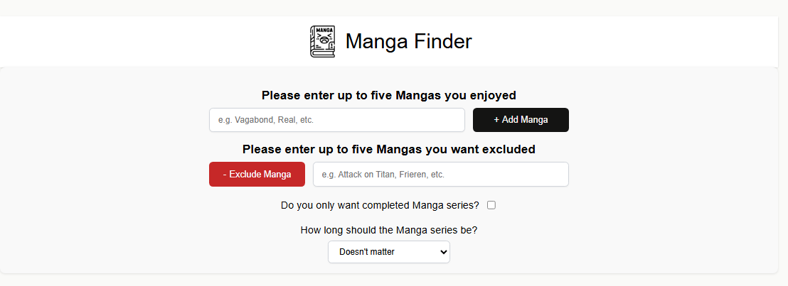
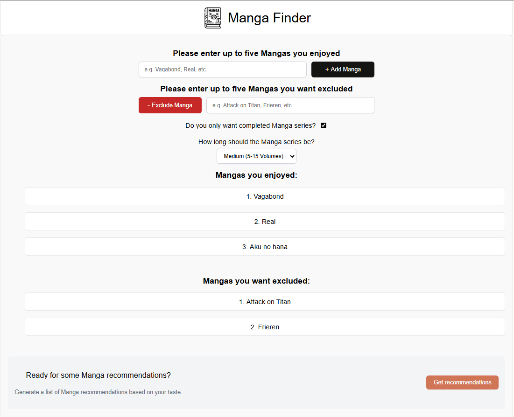
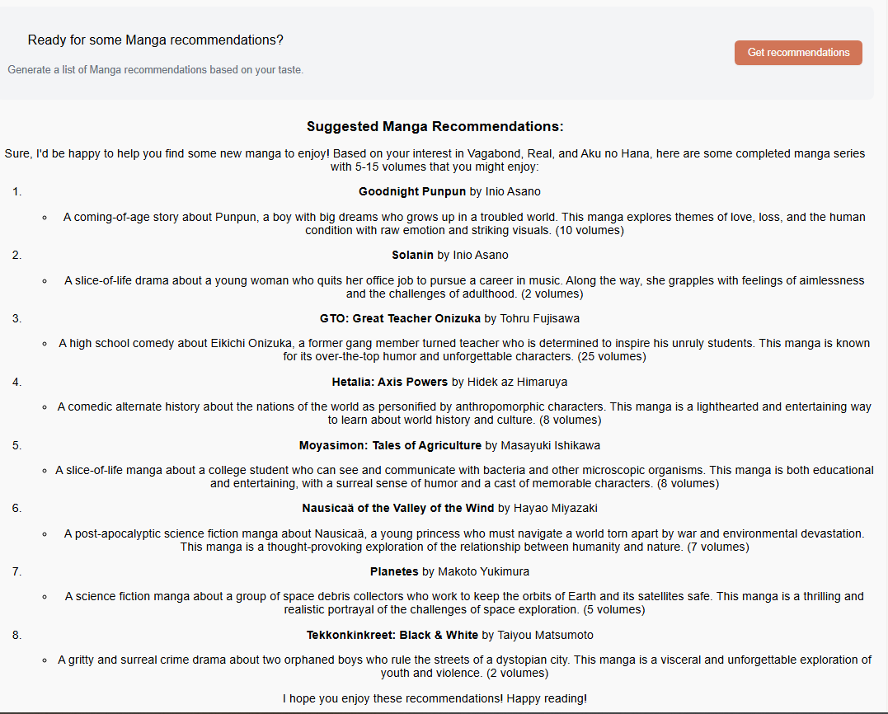

# Sebastian Riedel Portfolio

Welcome to my portfolio! Here you'll find some of the web projects I've built.

---

### 1. Manga recommendation service
**Description:**  
This app uses a AI implementation to generate Manga recommendations for the user. The user has the ability to input up to five Mangas he enjoyed reading in the past, up to five Mangas he didn't like and therefor wants to be excluded and also has the possibilty to add further filters like the total length of the recommended Manga or if the Manga has to be completed. The app collects the users inputs and sends a generated prompt to the AI, in this case the Huggingface AI. The response from the AI gets run through the react-markdown component which generates a readable list of recommendations for the user.

Since I am using a AI, I had to use a personal token, which I cannot upload to github. Therefor I can't present a running live demo.

**GitHub Repo:** [Link to repo](https://github.com/SebastianR0589/manga_recommendation_project)

**Screenshots:**

**Features:**
- Fetch user preverences 
- Generates AI prompt to generate a recommendation list
- Creates a recommendation list based upon the AI response using react-markdown

**Tech Stack:**  
React, API integration, react-markdown